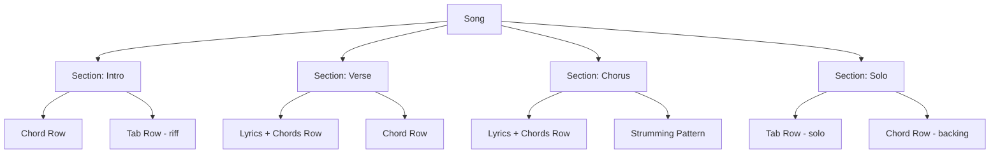

# FretKit Improvements Roadmap

## Goal: Evolve from Chord Charts → Full Song Editor

Support entire songs with sections, single-note tablature, lyrics with chord alignment, and mixed content types.

---

## Architecture Overview



---

## Feature Breakdown

### 1. Section-Based Song Structure

**What:** Replace the flat chord grid with named, reorderable sections (Intro, Verse, Chorus, Bridge, Solo, Outro, Custom).

**Logic:**
- Add a `SongSection` type containing a name, type, and an array of `SectionRow` items
- Each `SectionRow` is a discriminated union: `chord-row | tab-row | lyric-chord-row`
- Migrate the existing `ChordChart` type to a new `Song` type with a `sections: SongSection[]` field
- Update the main editor to render sections with add/remove/reorder controls
- Preserve backward compatibility by auto-wrapping legacy charts into a single "Untitled" section

**Required types:**
```typescript
type SectionType = 'intro' | 'verse' | 'chorus' | 'bridge' | 'solo' | 'outro' | 'custom';

interface SongSection {
  id: string;
  name: string;
  type: SectionType;
  rows: SectionRow[];
}

type SectionRow =
  | { kind: 'chord-row'; chords: ChordDiagram[] }
  | { kind: 'tab-row'; measures: TabMeasure[] }
  | { kind: 'lyric-chord-row'; segments: LyricChordSegment[] };

interface Song {
  id: string;
  title: string;
  artist?: string;
  key?: string;
  tempo?: number;
  timeSignature?: string;
  sections: SongSection[];
  strummingPattern?: StrummingPattern | null;
  createdAt: string;
  updatedAt: string;
}
```

**Prompt to implement:**
> Create a section-based song structure. Add the types `SongSection`, `SectionRow`, and `Song` to a new file `src/types/song.ts`. Update the main Index page to render songs as a list of collapsible, reorderable sections using dnd-kit. Each section should have a header with its name/type and buttons to add rows, rename, delete, and reorder. Keep the existing `ChordChart` type and add a migration utility that wraps a legacy `ChordChart` into a single-section `Song`. Update the chart state hook to work with the new `Song` type.

---

### 2. Tablature (Tab) Row Type

**What:** A 6-line staff where users click cells to enter fret numbers (0–24) for single-note riffs, picking patterns, and solos.

**Logic:**
- Each tab row contains measures; each measure contains columns (time positions)
- Each column has 6 values (one per string), each either a fret number or null
- Render as a grid: 6 horizontal lines (strings E-A-D-G-B-e), columns for each time position
- Click a cell to enter a fret number; use keyboard for quick entry (type digits, arrow keys to navigate)
- Support copy/paste of measures and common guitar techniques notation (h=hammer-on, p=pull-off, /=slide)

**Required types:**
```typescript
interface TabNote {
  fret: number | null;
  technique?: 'h' | 'p' | '/' | '\\' | 'b' | 'r' | '~'; // hammer, pull, slide up/down, bend, release, vibrato
}

interface TabColumn {
  strings: [TabNote, TabNote, TabNote, TabNote, TabNote, TabNote]; // E A D G B e
}

interface TabMeasure {
  id: string;
  columns: TabColumn[];
  timeSignature?: string;
}
```

**Prompt to implement:**
> Add a tablature row component. Create `src/types/tab.ts` with `TabNote`, `TabColumn`, and `TabMeasure` types. Create `src/components/TabRowEditor.tsx` that renders a 6-string grid where each row is a guitar string (labeled e B G D A E from top to bottom). Users click a cell to select it and type a fret number (0–24). Support arrow-key navigation between cells. Each measure has a configurable number of columns (default 8). Add buttons to insert/delete columns and measures. Create `src/components/TabRowDisplay.tsx` for the read-only/print view using a monospace font. Integrate the tab row as a selectable row type within song sections.

---

### 3. Lyrics + Chords Row Type

**What:** A text line where users type lyrics and position chord names above specific syllables, similar to Ultimate Guitar format.

**Logic:**
- Store as an array of segments, each with a chord (optional) and lyric text
- In edit mode: show a text input for lyrics with clickable insertion points for chords above
- In display mode: render chords above the corresponding lyric positions with proper spacing
- Support splitting and merging segments when editing

**Required types:**
```typescript
interface LyricChordSegment {
  chord?: string;       // Chord name positioned above this segment
  text: string;         // Lyric text for this segment
}

// A full lyric-chord line
interface LyricChordLine {
  id: string;
  segments: LyricChordSegment[];
}
```

**Prompt to implement:**
> Add a lyrics-with-chords row type. Create `src/types/lyrics.ts` with `LyricChordSegment` and `LyricChordLine` types. Create `src/components/LyricChordEditor.tsx` where users type lyrics in a text input. When the user clicks a position between/above words, a small chord input appears to attach a chord name at that position. The editor splits text into segments at chord attachment points. Create `src/components/LyricChordDisplay.tsx` for the read-only view that renders chord names in a line above the lyrics, positioned to align with their corresponding syllable. Use the existing chord autocomplete from `filterChordSuggestions` for the chord input. Style the display with a monospace or proportional font that maintains alignment. Integrate as a selectable row type within song sections.

---

### 4. Timeline / Measure View (Optional Enhancement)

**What:** A horizontal, bar-based timeline showing measures with beats, chord changes, and strumming pattern fragments.

**Logic:**
- Each measure has a time signature and a sequence of beats
- Beats can hold chord changes, rests, or sustains
- Render as a horizontal scrolling strip with bar lines
- Useful for planning arrangements and visualizing song form

**Prompt to implement:**
> Add a timeline/measure view as an optional visualization mode for songs. Create `src/components/TimelineView.tsx` that renders a horizontally scrolling strip of measures. Each measure shows its bar number, time signature, and chord changes as colored blocks spanning the appropriate beats. Clicking a beat opens a popover to assign or change the chord. The timeline should sync with the section structure—show section boundaries as labeled dividers. Add a toggle in the song editor toolbar to switch between "section view" (default) and "timeline view".

---

## Implementation Order

```
Phase 1 (Foundation):
  └─ Section-based song structure + types + migration from ChordChart

Phase 2 (Content Types):
  ├─ Tab row editor + display
  └─ Lyrics + chords editor + display

Phase 3 (Polish):
  ├─ Timeline view
  ├─ Print layout for mixed content
  └─ Import/export (Ultimate Guitar format, MusicXML)
```

---

## Migration Strategy

1. Keep `ChordChart` type intact for backward compatibility
2. Add `Song` as the new primary type
3. Auto-detect format on load: if data has `sections`, treat as `Song`; otherwise wrap legacy `ChordChart` into a single-section `Song`
4. Update storage providers to handle both formats during transition
5. Eventually deprecate `ChordChart` once all data is migrated

---

## Database Schema Changes

```sql
-- New songs table (replaces charts for new data)
CREATE TABLE IF NOT EXISTS songs (
  id TEXT PRIMARY KEY,
  title TEXT NOT NULL,
  artist TEXT,
  key TEXT,
  time_signature TEXT,
  tempo INTEGER,
  sections TEXT NOT NULL,        -- JSON array of SongSection
  strumming_pattern TEXT,        -- JSON StrummingPattern (global default)
  notes TEXT,
  created_at INTEGER NOT NULL,
  updated_at INTEGER NOT NULL
);

CREATE INDEX IF NOT EXISTS idx_songs_updated_at ON songs(updated_at DESC);
```
